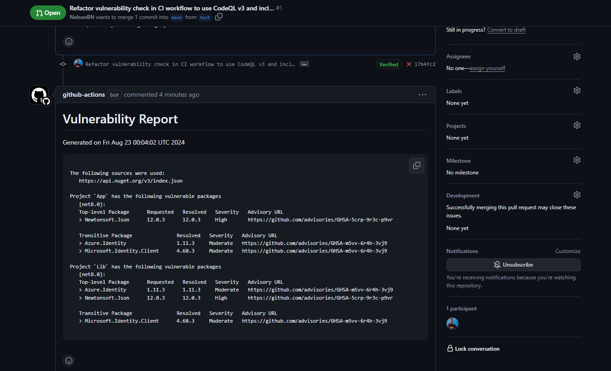
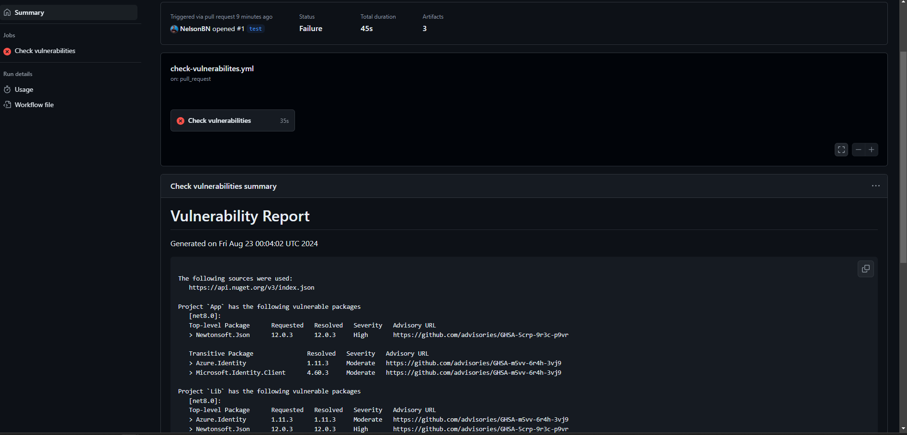
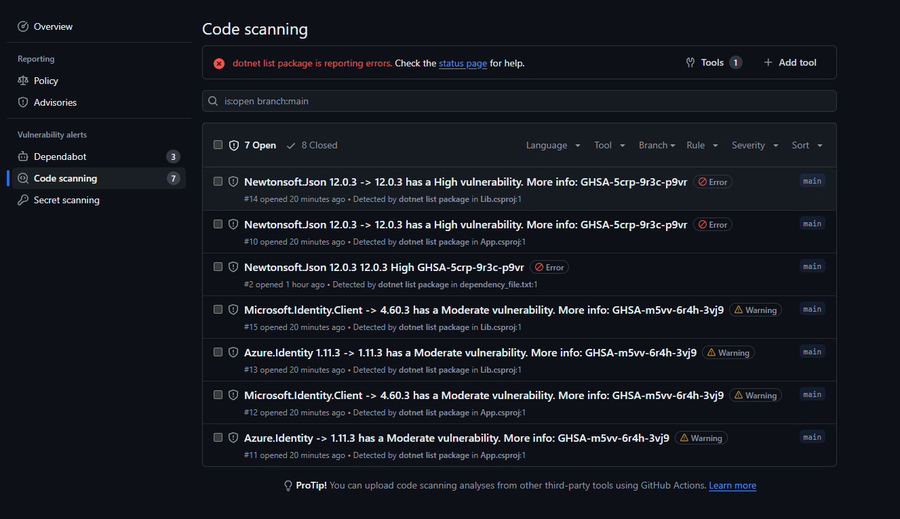

# Demo - .NET vulnerabilities report with GitHub Actions

In this demo, we can see how we can use GitHub Actions to scan a .NET project for vulnerabilities and report them in the Security tab of the repository.

We will report the vulnerabilities using the SARIF format, which is a standard format for the output of static analysis tools. The the result will be displayed in the Security tab of the repository.

We also will see how to report a security vulnerability to summary actions

- [SARIF support for code scanning](https://docs.github.com/en/enterprise-cloud@latest/code-security/code-scanning/integrating-with-code-scanning/sarif-support-for-code-scanning)

- [Privately reporting a security vulnerability](https://docs.github.com/en/code-security/security-advisories/guidance-on-reporting-and-writing-information-about-vulnerabilities/privately-reporting-a-security-vulnerability)

- [Demo PR](https://github.com/NelsonBN/github-actions-dotnet-report-vulnerabilities/pull/1)

